# WaveGuard — Rapport de synthèse
**Système de Détection de Fraude Mobile Money en Temps Réel**
Ecole Polytechnique de Thiès — Big Data DIC2/GIT 2025-2026

---

## Architecture déployée

```
producer.py ──> [Kafka: transactions] ──> waveguard_detector.py (Spark Streaming)
                                               ├──> [Kafka: fraud-alerts]
                                               └──> [Parquet: /tmp/waveguard_lake/]
```

---

## Partie 0 — Mise en place de l'environnement

### 0.1 Installation des dépendances Python

```powershell
pip install confluent-kafka pyspark==3.4.0 faker
```

### 0.2 Démarrage de la stack Docker et vérification

```powershell
docker compose up -d
docker compose ps
```

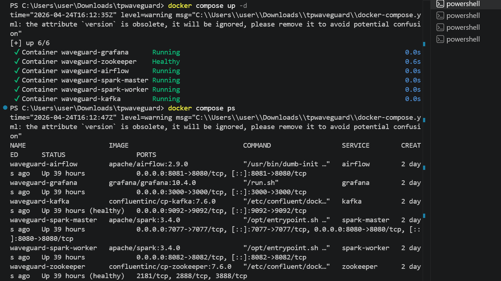

---

## Partie 1 — Ingestion Kafka

### 1.1 Création des topics

| Topic        | Partitions | Rôle                            |
|--------------|------------|---------------------------------|
| transactions | 3          | Flux principal des transactions |
| fraud-alerts | 1          | Alertes de fraude détectées     |
| audit-log    | 2          | Journal d'audit                 |

```powershell
docker exec waveguard-kafka kafka-topics --bootstrap-server localhost:9092 --create --topic transactions --partitions 3 --replication-factor 1
docker exec waveguard-kafka kafka-topics --bootstrap-server localhost:9092 --create --topic fraud-alerts --partitions 1 --replication-factor 1
docker exec waveguard-kafka kafka-topics --bootstrap-server localhost:9092 --create --topic audit-log --partitions 2 --replication-factor 1
```

### 1.2 Vérification des topics créés

```powershell
docker exec waveguard-kafka kafka-topics --bootstrap-server localhost:9092 --describe --topic transactions
```

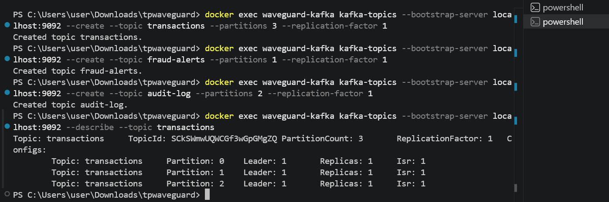

---

### Q1 — Justification du nombre de partitions

**3 partitions pour `transactions`** : le topic transactions reçoit un flux intense (~5 à 20 tx/sec). Avec 3 partitions, 3 consumers Spark peuvent lire en parallèle, ce qui multiplie le débit de traitement. On utilise `sender_id` comme clé Kafka : le partitionneur hash garantit alors que toutes les transactions d'un même compte arrivent dans la même partition, ce qui préserve l'ordre par compte.

**1 partition pour `fraud-alerts`** : les alertes doivent être consommées dans l'ordre où elles sont générées. Plusieurs partitions casseraient cet ordre global. Une seule partition garantit que les alertes sont lues dans l'ordre, ce qui est essentiel pour un système financier.

**Impact sur l'ordre** : Kafka ne garantit l'ordre qu'au sein d'une partition. Avec la clé `sender_id`, l'ordre des transactions d'un même compte est assuré même après redémarrage.

---

### 1.3 Lancement du producer (terminal 1)

```powershell
python jobs/producer.py
```

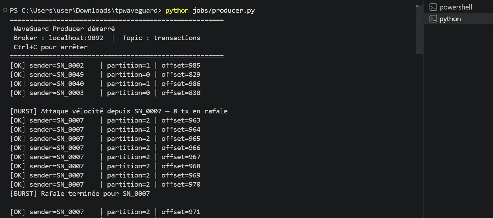

### 1.4 Vérification via le consumer console (terminal 2)

```powershell
docker exec waveguard-kafka kafka-console-consumer --bootstrap-server localhost:9092 --topic transactions --from-beginning --max-messages 10
```

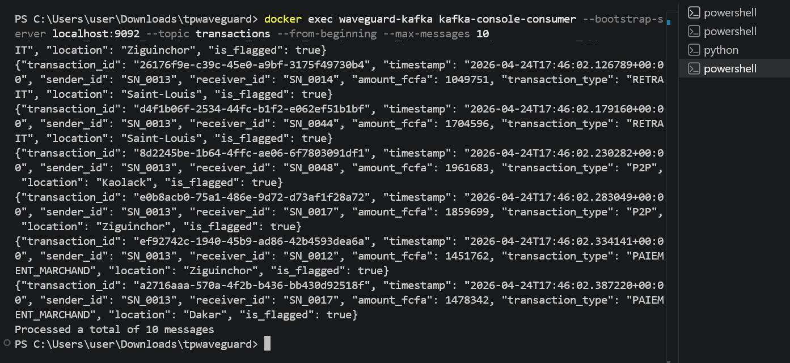

---

### Q2 — Ordre des messages et configuration du Producer

Kafka ne garantit pas l'ordre à l'échelle du topic entier, uniquement au sein d'une partition. Pour s'assurer que toutes les transactions d'un compte arrivent toujours dans la même partition, on utilise `sender_id` comme clé : le partitionneur par défaut (hash de la clé modulo nb_partitions) assigne systématiquement la même clé à la même partition.

Pour renforcer la fiabilité, on configure aussi le Producer avec `acks=all` (confirmation de tous les replicas), `enable.idempotence=true` (évite les doublons en cas de retry) et `max.in.flight.requests.per.connection=1` (empêche le réordonnancement en cas de retry).

---

### Q3 — Kafka vs RabbitMQ pour WaveGuard

On choisit **Apache Kafka** pour WaveGuard. WaveGuard doit traiter des millions de transactions par jour en temps réel, et Kafka est conçu pour ça avec son architecture distribuée capable d'absorber des millions de messages par seconde. La rétention des messages est aussi un gros avantage : ça permet de rejouer les données pour corriger des bugs dans les règles de détection sans rien perdre. Et l'intégration native avec Spark Structured Streaming simplifie beaucoup l'architecture.

RabbitMQ ne convient pas ici : les messages sont supprimés après lecture (pas de replay possible) et le débit ne suit pas à grande échelle. C'est plutôt adapté à du routage de tâches async ou des workflows complexes, pas à un pipeline de streaming financier.

---

## Partie 2 — Spark Structured Streaming

### 2.1 Commande de lancement du detector

```powershell
spark-submit --packages org.apache.spark:spark-sql-kafka-0-10_2.12:3.5.0 jobs/waveguard_detector.py
```

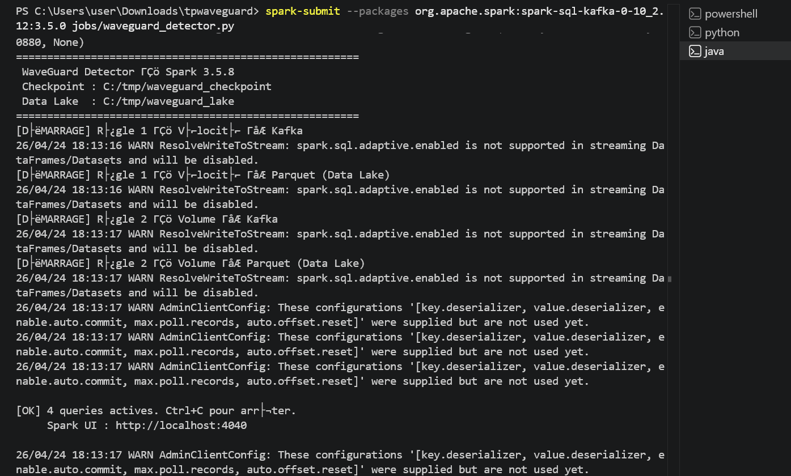

### 2.2 Capture — Alertes détectées dans fraud-alerts

```powershell
docker exec waveguard-kafka kafka-console-consumer --bootstrap-server localhost:9092 --topic fraud-alerts --from-beginning
```

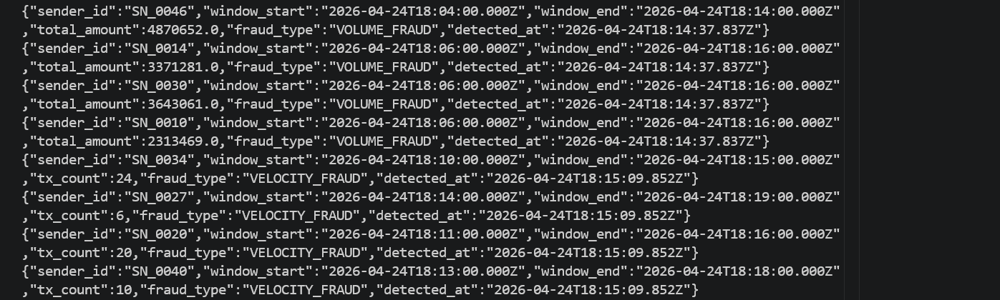

### 2.3 Capture — Fichiers Parquet dans le Data Lake

```powershell
Get-ChildItem C:\tmp\waveguard_lake\
Get-ChildItem C:\tmp\waveguard_lake\velocity\
```

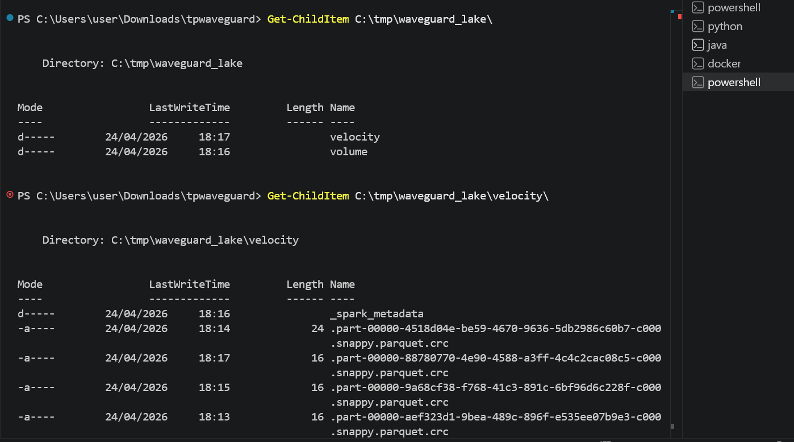

### 2.4 Capture — Spark UI
> Ouvrir http://localhost:4040 pendant que le detector tourne

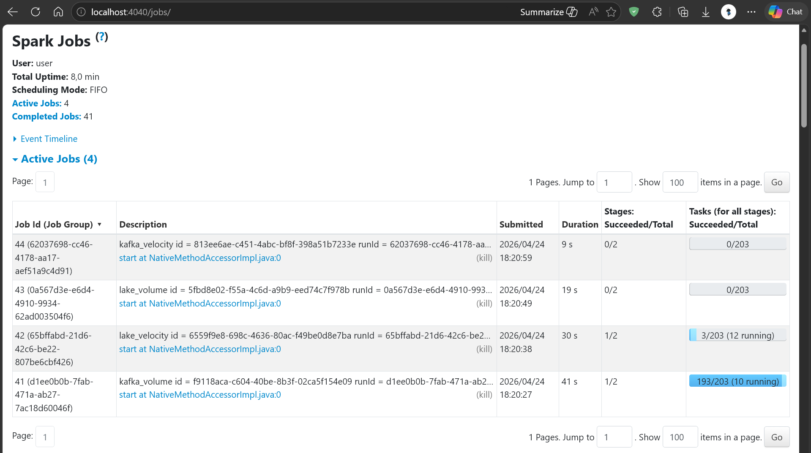

---

### Q4 — Tumbling Window vs Sliding Window

Une **Tumbling Window** est une fenêtre fixe sans chevauchement. Par exemple avec `window('5 min')` on obtient les fenêtres 0:00-5:00, 5:00-10:00, etc. Chaque événement appartient à exactement une fenêtre. Le problème, c'est qu'une attaque à cheval entre deux fenêtres (ex : 4 tx de 4:30 à 5:30) serait répartie et ne déclencherait aucune alerte.

Une **Sliding Window** se chevauche. Avec `window('5 min', '1 min')`, une nouvelle fenêtre de 5 min démarre toutes les minutes. Un événement peut appartenir à plusieurs fenêtres simultanément.

On choisit la sliding window pour la détection de fraude parce qu'un fraudeur peut lancer son attaque à n'importe quel moment, pas forcément au début d'une fenêtre fixe. La sliding garantit que toute séquence de transactions sur 5 minutes sera couverte par au moins une fenêtre complète.

Exemple concret avec nos paramètres : SN_0042 envoie 8 transactions entre 10:03 et 10:07. Les fenêtres [10:03-10:08], [10:02-10:07], etc. sont évaluées — l'une d'elles captera les 8 tx et déclenchera l'alerte VELOCITY_FRAUD.

---

### Q5 — outputMode update vs append

On utilise `outputMode('update')` pour le sink Kafka parce qu'on veut envoyer une alerte dès qu'elle est mise à jour (ex : un compte passe de 4 à 6 tx dans une fenêtre glissante). Le mode update n'envoie que les lignes nouvelles ou modifiées à chaque micro-batch, ce qui est exactement ce qu'on veut pour des alertes temps réel.

On utilise `outputMode('append')` pour le sink Parquet parce que Parquet est un format immutable : on ne peut pas modifier un fichier déjà écrit. Le mode append n'écrit que les lignes définitives (après le watermark), ce qui est le seul comportement cohérent avec un stockage de ce type.

Le mode `complete` serait problématique ici parce qu'il réécrit toute la table à chaque micro-batch. Sur un volume croissant d'alertes, ça représenterait des I/O qui explosent exponentiellement — inutilisable en production.

---

## Partie 3 — Tolérance aux pannes

### 3.1 Procédure crash et reprise

```powershell
# Etape 1 : noter les offsets Spark avant le crash
Get-ChildItem C:\tmp\waveguard_checkpoint\kafka_velocity\offsets\ | Where-Object { $_.Name -notlike ".*" } | Sort-Object { [int]$_.Name } | Select-Object -Last 5
```

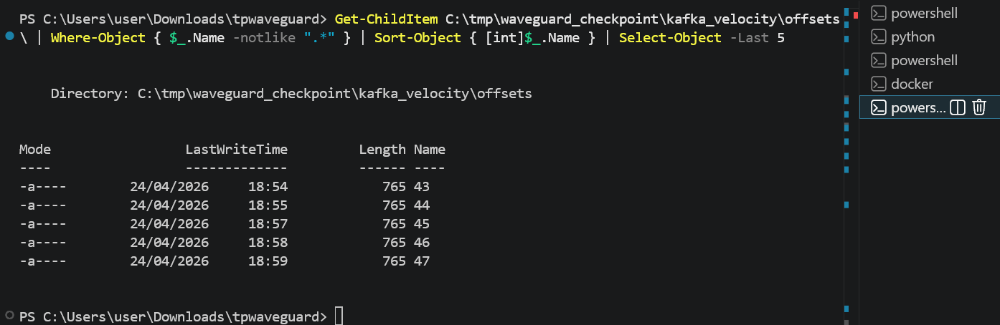

```powershell
# Etape 2 : simuler le crash
# Fermer brutalement le terminal du detector (croix rouge)

# Etape 3 : attendre 30 secondes (le producer continue)
Start-Sleep -Seconds 30

# Etape 4 : relancer SANS toucher au checkpoint
spark-submit --packages org.apache.spark:spark-sql-kafka-0-10_2.12:3.5.0 jobs/waveguard_detector.py

```

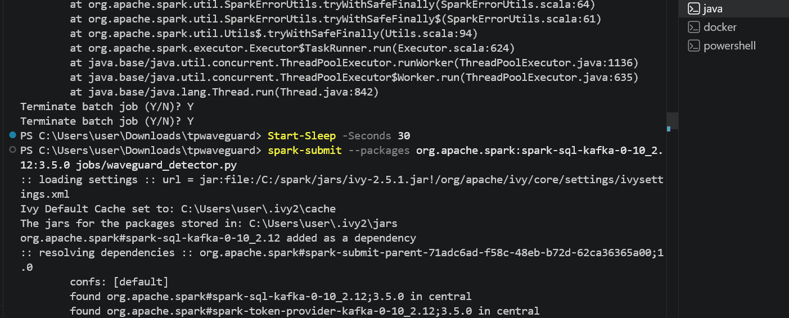

```powershell
# Etape 5 : vérifier que Spark a bien repris (nouveaux fichiers d'offset créés)
Get-ChildItem C:\tmp\waveguard_checkpoint\kafka_velocity\offsets\ | Where-Object { $_.Name -notlike ".*" } | Sort-Object { [int]$_.Name } | Select-Object -Last 5
```

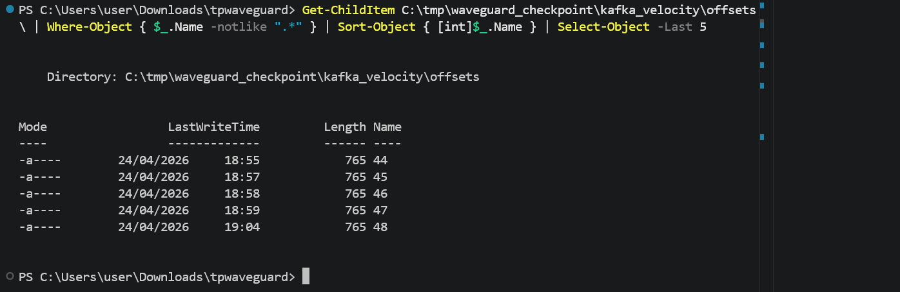

### 3.2 Capture — Arborescence du checkpoint

```powershell
Get-ChildItem -Recurse C:\tmp\waveguard_checkpoint\ | Select-Object Name, LastWriteTime | Select-Object -First 20
```

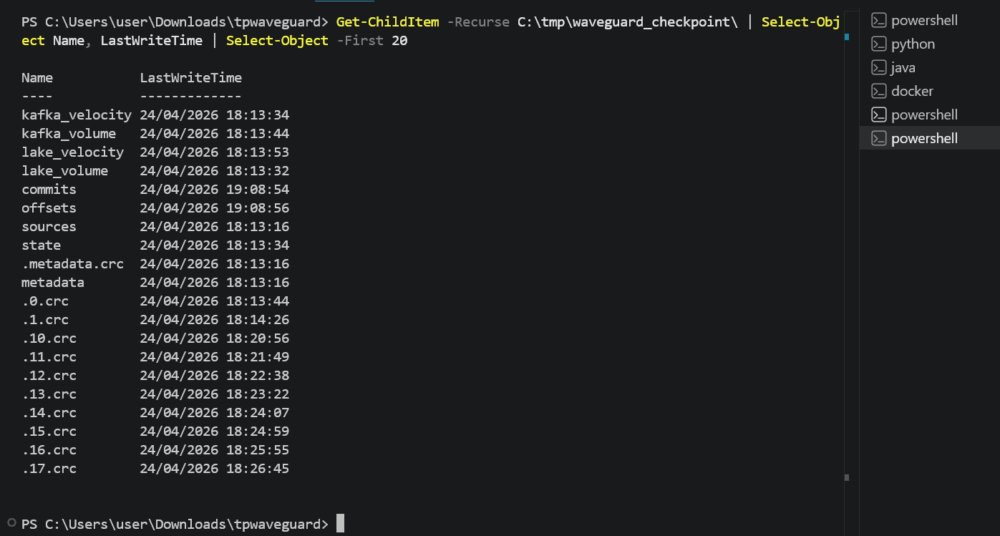

---

### Q6 — Mécanisme de checkpoint Spark

Le checkpoint fonctionne en trois étapes à chaque micro-batch. Avant de traiter un batch, Spark écrit dans `offsets/batch_N` les offsets Kafka qu'il va consommer. Il traite ensuite les données et écrit dans les sinks. Une fois le sink écrit avec succès, il enregistre `commits/batch_N` pour marquer le batch comme terminé.

Au redémarrage, Spark regarde le dernier `offsets/N` et `commits/N`. Si `offsets/N` existe mais pas `commits/N`, il reprend le batch N depuis le début. S'ils existent tous les deux, il repart à N+1.

Si on supprime le checkpoint, Spark repart de zéro depuis `startingOffsets='latest'`. Toutes les transactions émises pendant l'arrêt seraient perdues et les compteurs de fenêtres glissantes réinitialisés — ce qui pourrait produire des faux négatifs.

---

### Q7 — Conditions pour Exactly-Once end-to-end

Pour le **Producer Kafka** : `enable.idempotence=true` évite les doublons en cas de retry, `acks=all` attend la confirmation de tous les replicas. Si on veut aller encore plus loin, `transactional.id` permet des transactions Kafka atomiques.

Pour **Spark Structured Streaming** : le checkpoint activé permet à Spark de rejouer exactement les mêmes offsets après un crash. Le sink Parquet en mode `append` avec checkpoint est idempotent (Spark vérifie si le fichier existe avant d'écrire).

La limitation principale concerne le **sink Kafka** (`fraud-alerts`) : si Spark crashe après avoir écrit dans Kafka mais avant d'avoir commité, les alertes peuvent être dupliquées. On est donc en at-least-once pour ce sink, sauf si on configure les transactions Kafka avec `Trigger.AvailableNow`.

En résumé : exactly-once est garanti pour le sink Parquet. Pour Kafka-to-Kafka, c'est at-least-once en pratique sans configuration transactionnelle avancée.

---

## Partie 4 — Monitoring Grafana

### 4.1 Accès Grafana
```
URL      : http://localhost:3000
Login    : admin
Password : waveguard
```


### 4.2 Commande — Lancer l'exporter de métriques
```powershell
python jobs/metrics_exporter.py
```

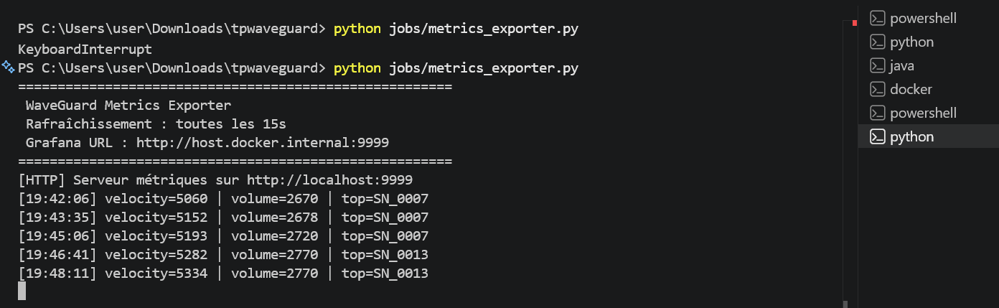

### 4.3 Dashboard WaveGuard (4 panels)

```
Créer dans Grafana : Dashboard WaveGuard avec 4 panels
Panel 1 : Alertes Vélocité (Stat, seuil rouge > 10)
Panel 2 : Alertes Volume (Stat, seuil rouge > 5)
Panel 3 : Top Fraudeur (Text)
Panel 4 : Total Alertes (Stat)
```

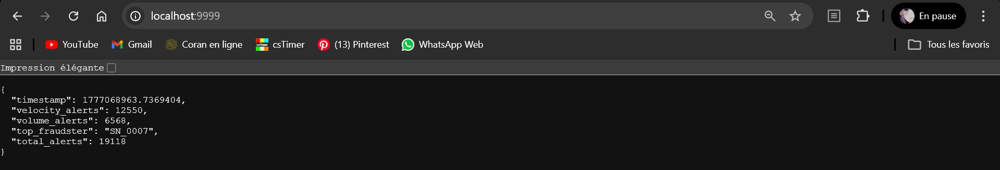

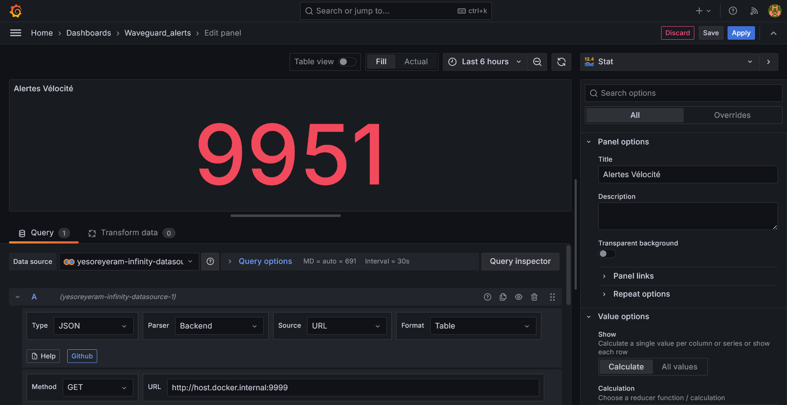

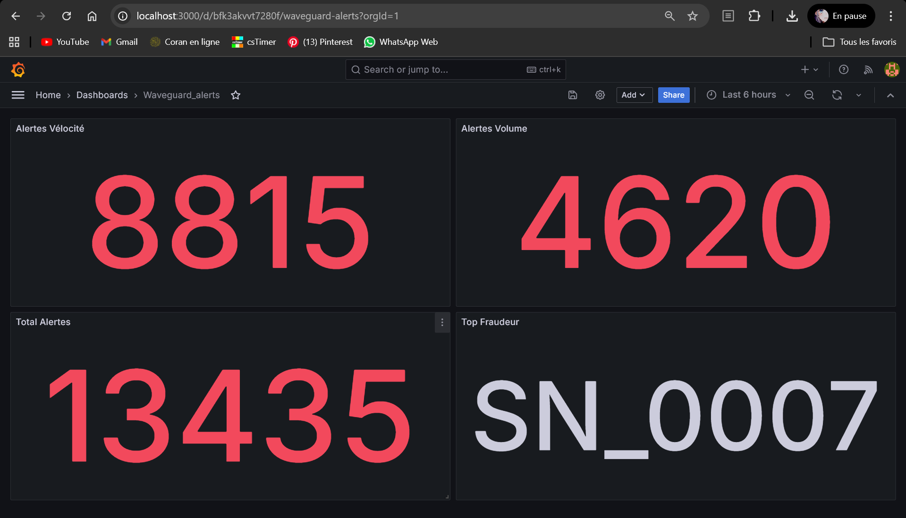

### 4.4 Alerte configuration

```
Condition : velocity_alerts > 10 sur 5 minutes
```

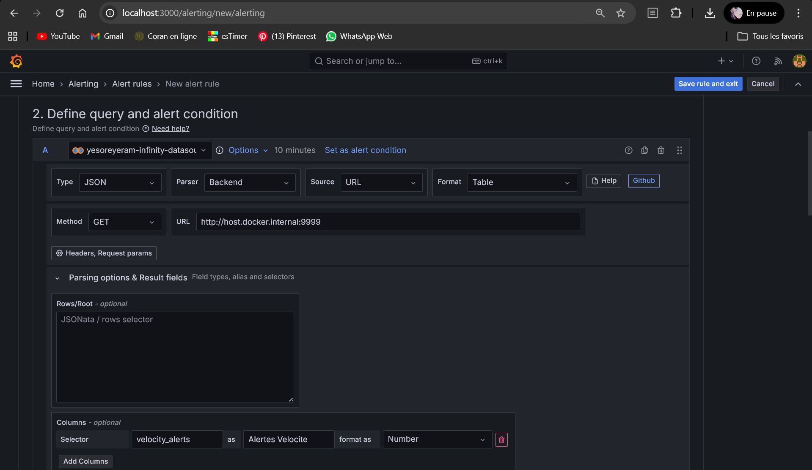

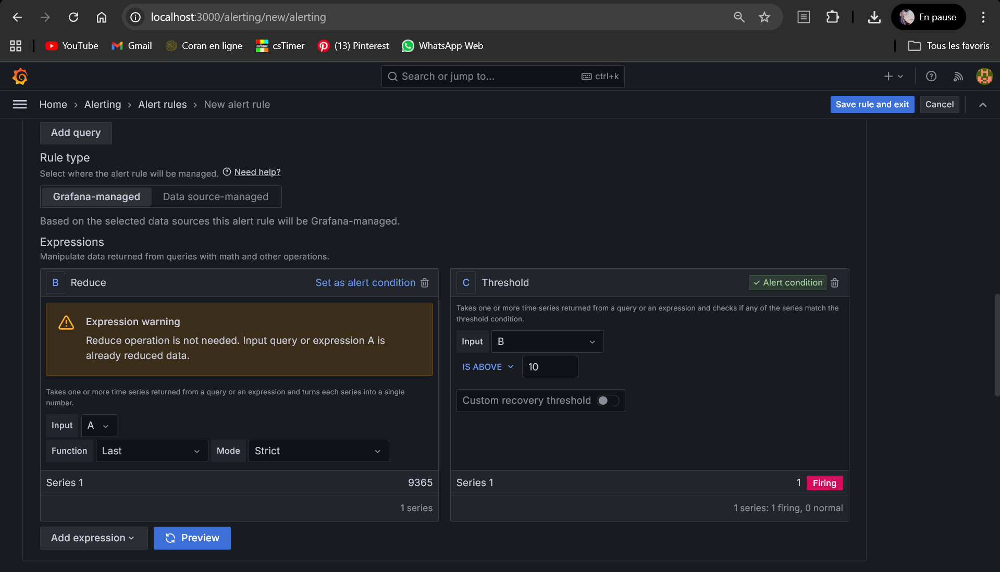

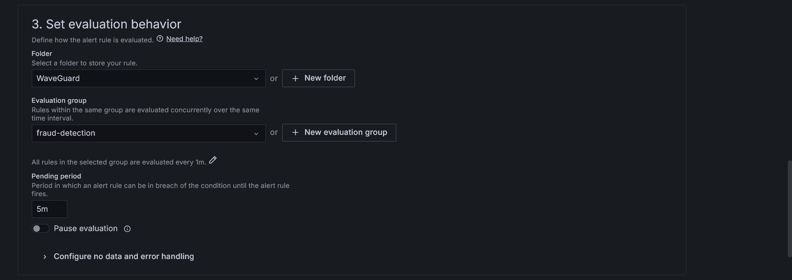

### 4.5 Alerte configurée

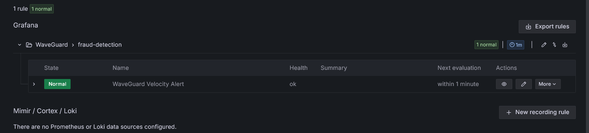

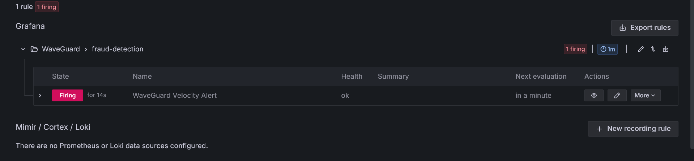

---

### Q8 — Architecture de monitoring en production

En production, on utiliserait **JMX Exporter + Prometheus** pour Kafka (expose les métriques broker, consumer lag, débit) et le **Spark Metrics System** (Dropwizard) côté Spark, avec un Prometheus Pushgateway pour collecter les métriques des jobs. Grafana se connecte ensuite à Prometheus comme datasource.

L'avantage par rapport au JSON exporter du TP : Prometheus scrappe automatiquement toutes les 15 secondes, l'historique des métriques est persisté, et il existe des dizaines de dashboards Grafana préconstruits pour Kafka et Spark dans la communauté. On peut aussi brancher des alertes vers PagerDuty ou Slack directement depuis Grafana.

```
Kafka JMX ──> Prometheus ──> Grafana Dashboards + Alerting
Spark JMX ──> Prometheus ──┘        └──> Slack / Email / PagerDuty
```

---

*WaveGuard — EPT Big Data 2025-2026*